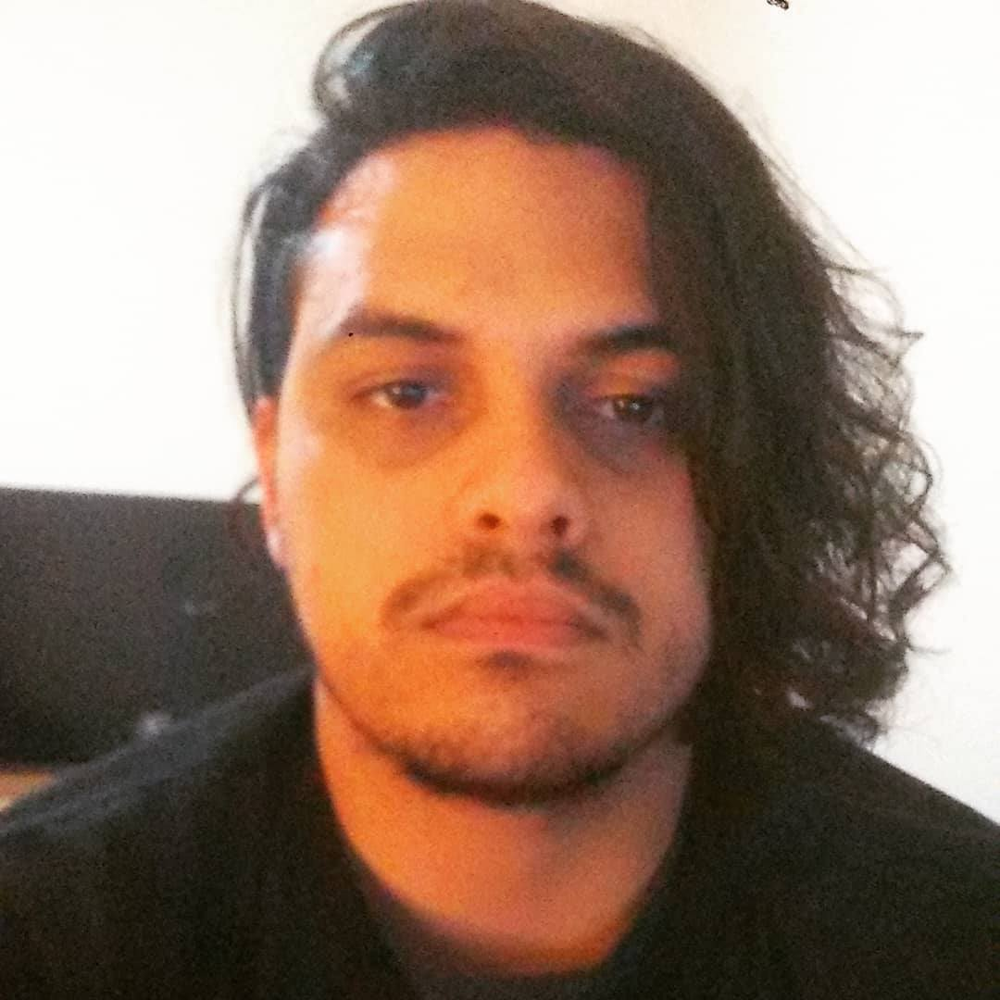

# Hello there, I'm I'm André Iván. 

<p style="text-align: center;">
  
</p>

## I'm a Venezuelan guy based in Argentina. I have been working as a freelance and for services companies since I started programming professionally as a Frontend Developer for the last 5 years.</p>

# My site https://andreivan.me 

[](https://twitter.com/maitzeth)

[](https://www.linkedin.com/in/andre-ivan-mz/)

[](https://github.com/maitzeth)

```javascript
{
  code: [JavaScript, HTML, CSS],
  tools: [React, Redux, Next, Gatsby, Styled-Components, ReactNative, ...ManyMore],
  current_challenge: "Learning TypeScript and some backend"
}
```